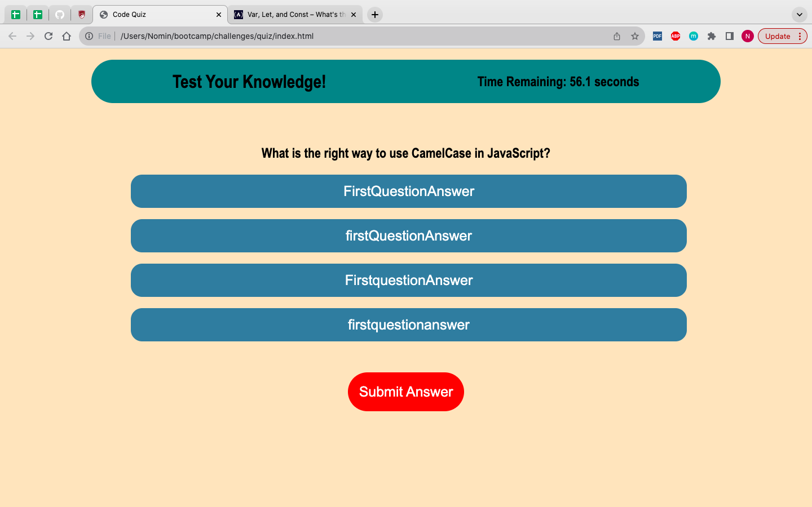
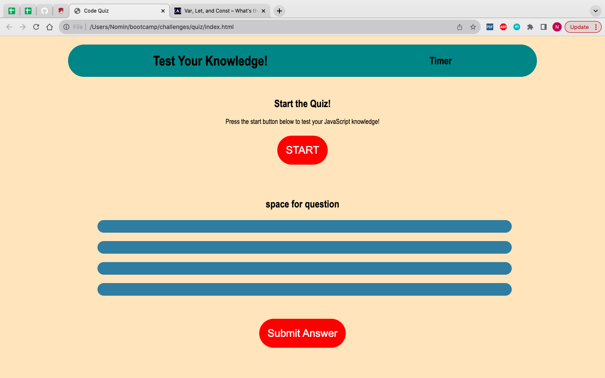

# Coding Quiz

## Description
This challenge required us to create a quiz using the skills we've learned for HTML, CSS, and JavaScript. This quiz asks 5 simple questions about JavaScript and will rank the user at the end. There is a running timer at the top of the page to help the user keep track of time. 

## Installation
n/a

## Usage
User can press start button to start the quiz and begin the timer. when timer begins, user must make choice before time runs out. wrong answers will subtract 5seconds from the timer.

https://nomin97.github.io/coding-quiz/

## Credit
Help on creating timer. [https://www.educative.io/answers/how-to-create-a-countdown-timer-using-javascript]
Also help from tutor not on actual code but help pseudocoding. 
Information from class activities and mini-projects helped. 

## License
Please refer to LICENSE in repository. 
